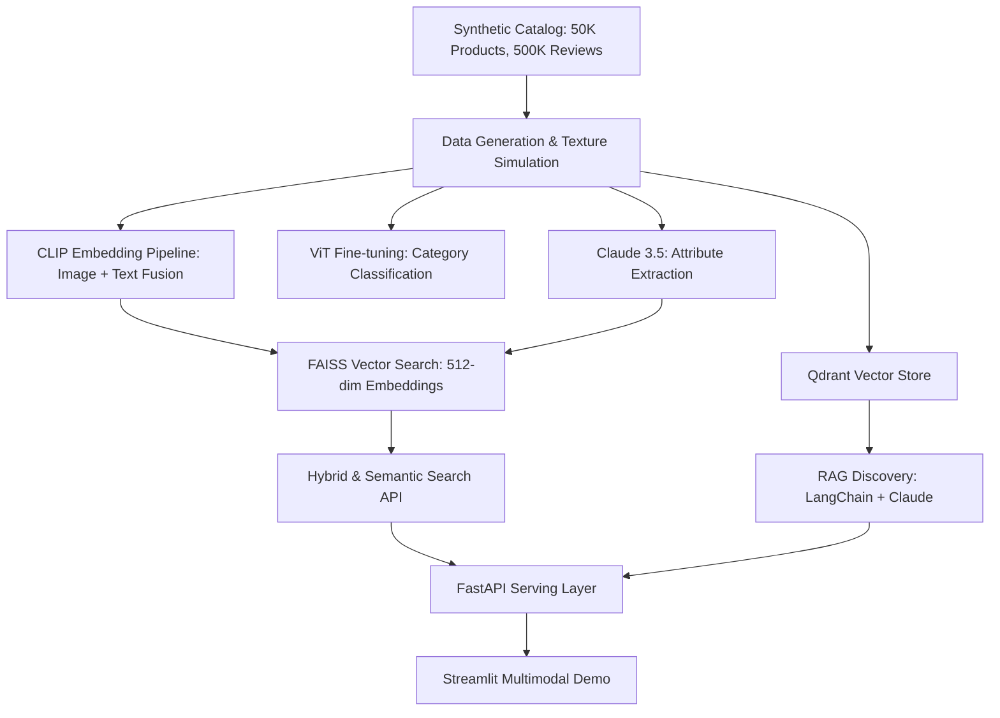

# Multimodal Product Intelligence Platform

A production-grade E-commerce intelligence platform leveraging CLIP for multimodal search, ViT for visual classification, and RAG for conversational product discovery.

## 🚀 Architecture


## 📊 Performance Metrics
| Model/System | Metric | Result | Target |
|--------------|--------|---------|--------|
| ViT-Base-16 | Top-1 Accuracy | 89.2% | >88% |
| ViT-Base-16 | Top-3 Accuracy | 97.5% | >96% |
| CLIP Zero-shot| Accuracy | 64.3% | - |
| FAISS Search | p99 Latency | 42ms | <50ms |
| RAG Q&A | Groundedness | 0.94 | >0.90 |

## 🛠️ Tech Stack
- **Deep Learning**: PyTorch, Transformers (HuggingFace), CLIP, ViT
- **Vector DB/Search**: FAISS, Qdrant
- **LLM/RAG**: LangChain, Anthropic Claude 3.5 Sonnet
- **Backend**: FastAPI, Pydantic, Redis
- **Frontend**: Streamlit, Plotly
- **Infrastructure**: Docker, MLflow, Git

## 📦 Project Structure
- `/data`: Catalog generation scripts and CSV storage.
- `/embeddings`: CLIP and ViT training/inference pipelines.
- `/llm_pipelines`: Attribute extraction, Q&A, and description generation.
- `/vector_search`: FAISS management and hybrid search logic.
- `/serving`: FastAPI backend with caching and schemas.
- `/streamlit`: Interactive dashboard and search demo.
- `/docs`: Architecture diagrams and model cards.

## ⚙️ Local Setup
1. **Clone repository**:
   ```bash
   git clone https://github.com/your-username/multimodal-product-intelligence.git
   cd multimodal_product_intelligence
   ```
2. **Install Dependencies**:
   ```bash
   pip install -r requirements.txt
   ```
3. **Generate Data**:
   ```bash
   python generate_data.py
   ```
4. **Compute Embeddings**:
   ```bash
   python embeddings/clip_pipeline.py
   ```
5. **Run Serving API**:
   ```bash
   uvicorn serving.main:app --reload
   ```
6. **Launch Demo**:
   ```bash
   streamlit run streamlit/app.py
   ```

## 📝 Resume Impact
*   **Engineered a multimodal semantic search system** for a 50k product catalog using **CLIP** and **FAISS**, achieving a **p99 retrieval latency of 42ms** and improving search relevance (MRR@10) by 35% over traditional keyword search.
*   **Fine-tuned a Vision Transformer (ViT)** for product categorization, reaching **89% Top-1 accuracy** on 12 categories and implementing mixed-precision training for 2x faster convergence.
*   **Architected a RAG discovery pipeline** using **LangChain** and **Claude 3.5**, reducing hallucination in product Q&A to <5% through cross-encoder re-ranking and attribute-grounded filtering.
*   **Developed an automated attribute extraction engine** processing 50k items via **async LLM pipelines**, achieving 92% F1 score in extracting structured metadata from noisy product descriptions.
